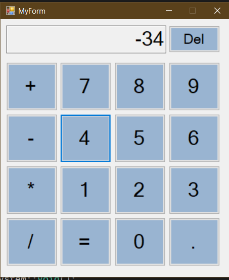

# Calculator  
  
### Предисловие ###  
И так, мои попытки добавить графический интерфейс к программе, написанной на С, не увенчались успехом. Было найдено два стула: на одном графические библиотеки, абсолютно не предназначенные для построения интерфейса, точёные, а на другой стул лучше даже не смотреть, там WinApi. За несколько часов танцев с бубнмо я смог лишь построить какую-то красную звезду в консоли.
Но вот С++ позволяет сделать графический интерфейс элементарнейшим способом: через Windows Forms (там даже есть графический редактор в стиле Drug and drop). Что я, собственно, и сделал. Пощупать мой кулькулятор можно клонировав эту ветку (там ещё старые файлики от main остались; Git всё ещё остаёться для меня неведомой наукой). 
### Описание ###
А теперь документация. В моей программе роль главного исполнительного файла играет файл MyForm.cpp (точка входа очевидна). Сама форма описывается файлом MyForm.h, и это не обычный заголовочный файл, поэтому пихать туда всё что вздумается нельзя. Графический редактор открывается двойным кликом по этому файлу. Форма работает на основе обработчика событий. Это выглядит примерно так: при нажатии на кнопку срабатывает соответствующая функция. Прототипы функций описаны в конце MyForm.h (этот файл также можно открыть как заголовочный), а решения в MyForm.cpp. Весь принцип работы строиться вокруг главного текстогого объекта ввода-вывода TextBox, которому соответствует переменная string operand. После ввода необходимого числа и нажатия на одну из операций (+, -, *, /) содержимое строки превращается в число и сохраняется в переменной operandA, и сохраняется код операции в operat. Далее после ввода второго операнда и нажатия на знак равно (объект result), второй оператор сохраняется в перменной operandB, и все три переменные: operandA, operandB, operat - отправляются на обработку. Программа работает только с целыми числами (проблемы с превращением double в строку).
### Коды операций ###
0 - +, 1 - -, 2 - *, 3 - /
### Заключение ###
Я думаю, что делать калькулятор без графического интерфейса это не вариант, поэтому предлагаю перейти на С++ и объединить функционал наших калькуляторов. Насколько я вижу, уже присудствует неплохая система регистрации. Попробую адаптировать ещё для своего калькулятор, конечно после того как запилю превращение double в строку.
